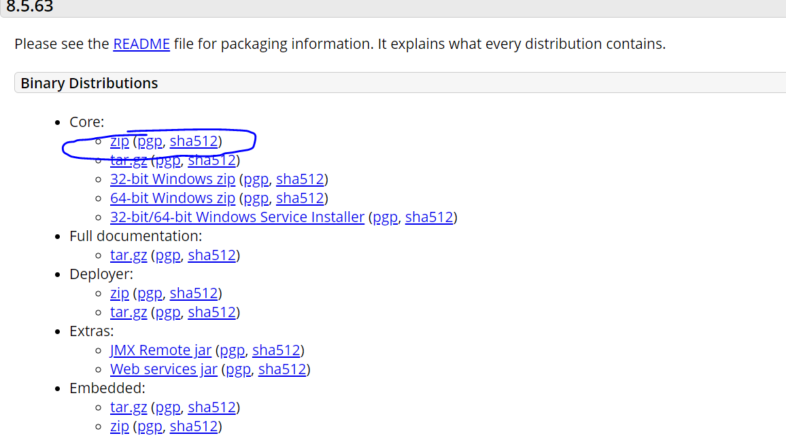
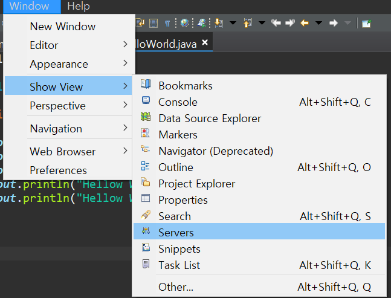
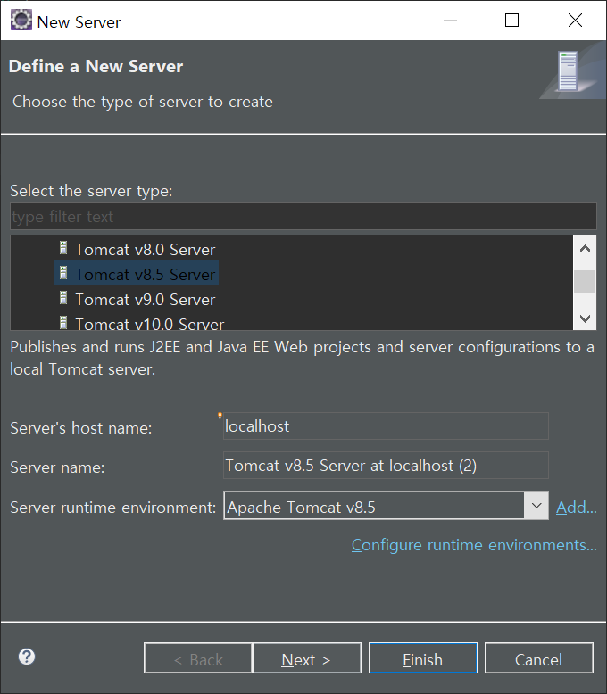
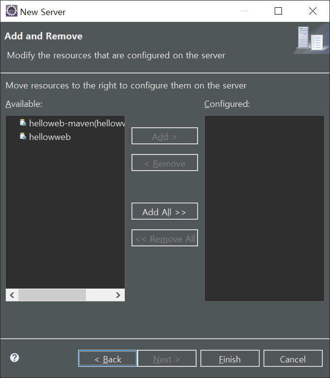

# JAVA의 개요

## JAVA 의 구성

JavaSE(Java Standard Edition)	-> Java Enterprise Development(자바 엔터프라이즈 개발, J2EE, JavaEE) -> web 어플리케이션
(JRE+JDK)			-> Server
			-> Android.App
JRE	: java.exe
JDK 	: 개발 툴 

## 웹 프로그래밍의 구조

Toncat(was)->java 위에서 도는 java aplication == Servlet Container, WebLogic, WebSphere, Jeus
Application이 동작 방법 : 각각의 Servlet/JSP 가 동작.

WAS가 관리하지 않는 프로그램 로직이나 기능들 : Enterprise Java Bean(기업환경의 시스템을 구현하기 위한 서버측 컴포넌트 모델) == object(객체)
EJB Container 생성.

* Servlet은 만들어 놓기만 한다면 언제는 호출해서 동작이 가능.(Method 형식으로 동작)

Java Enterprise Development(자바 엔터프라이즈 개발, J2EE, JavaEE)
기업 :	ERP
	유통,병원,검색 광고... 기업 비즈니스
	거의 모든 어플리케이션

JDB				RDBMS(MySQL, MariaDB, Oracle, DB2, MSSQLServer, PostgreSQL)

Servlet/JSP(자바 웹 프로그래밍)	Network(C/S) -> Web

Distribution(분) -RMI
JMS, JavaMail,JNDI

Java Web Programming == Servlet Programming

## Eclipse Setting

Eclipse 설치 (MSI x, 압축파일로 설치, 설치위치 확인)

워크 스페이스를 만든 후 -> encoding 설정, spelling, perspective

## Java Project의 종류

1. eclipse native project - java, dynamic web

2. 호환성 있는 표준 project - maven, gradle

3. maven, gradle : build tool

4. 설정 파일 pom.xml

5. mvn clean package

기본적인 Java 폴더 구성

src\
|----- com
	|---- bitacademy
		|---- HellowWorld.java

bin\
|----- com
	|---- bitacademy
		|---- HellowWorld.class

이부분은  =http://localhost:8080/hellowweb/HellowWeb.html 에서 확인 가능

## Tomcat 설정 방법

1. 

- 위의 방법으로 zip파일을 다운로드 한 후 압축 해제를 한다.
- (대게 C:\ 아래에 폴더하나를 생성 한 후 정리해 둔다.)

2.

- 을 선택해 이클립스 아래 부분에 server 탭을 누르고 아래의 "No servers are availabel click this link to create a new server" 를 클릭한다.

3.

- 에서 직접 설치한 tomcat 8.5버전을 클릭후 적용 시키면 해당 폴더가 있는 위치를 선택한다.

4. 

-  사용할 서버를 선택해 오른쪽으로 add를 시켜주면 비로소 서버 동작 시킬 준비가 된다.

5. 

- 서버를 실행시켜주면 자동으로 필요한 데이터를 업로드하면서 끝이난다.

## Git에 프로젝트 적용 방법

