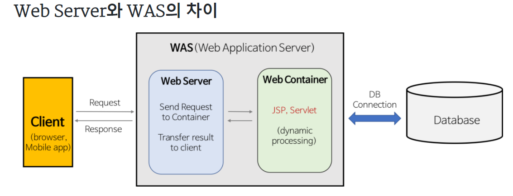
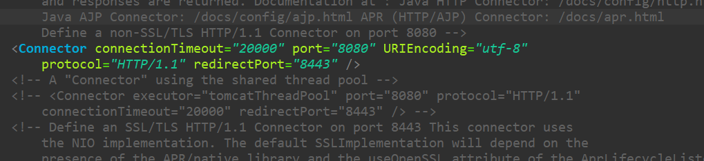
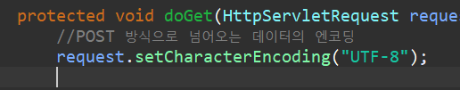

# 웹 프로그래밍

## internet의 구성

internet : 컴퓨터간의 상호 연결된 상태.
Internet : 전 세계에 걸쳐 원거리 접속이나 파일 전송, 전자 메일 등의 데이터 통신 서비스를 받을 수 있는, 컴퓨터 네트워크의 시스템.

우리나라의 computer,phone,자동차 등의 각 객체와의 상관관계는 망 형식으로 이어지며 연결되는 방식은 ethernet, wifi, bluetooth, 유선, 무선 등등으로 연결이 된다.

network : 유무선으로 연결된 디바이스들의 집합.
networking : 네트워크에 있는 디바이스들이 데이터 교환

네트워크 패킷 : 패킷은 정보 기술에서 패킷 방식의 컴퓨터 네트워크가 전달하는 데이터의 형식화된 블록이다. 패킷은 제어 정보와 사용자 데이터로 이루어지며, 이는 페이로드라고도 한다. 
- 패킷은 두가지로 나뉘는데 주소를 갖는 head, 내용 정보를 담는 body가 있다.
	* head : 주소 + 제어 정보(Protocol).
	* body : 데이터.

Protocol(통신 규약) : 데이터 교환을 하기위한 약속.(TCP/IP 로 포괄)
- FTP	: 파일 전송 프로토콜(File Transfer Protocol)의 약자로 TCP/IP 네트워크 상에서 컴퓨터들이 파일을 교환하기 위해 1971년에 최초로 공개된 통신 규약이다. 
- HTTP	: 하이퍼텍스트를 빠르게 교환하기 위한 프로토콜의 일종으로 즉, HTTP는 서버와 클라이언트의 사이에서 어떻게 메시지를 교환할지를 정해놓은 규칙인 것이다. 80번 포트를 사용하며 HTTP의 구조는 요청(Request)과 응답(Response)으로 구성되어 있다.


TCP/IP의 구조 = OS(Unix) : System Programming + Network Programming

TCP/IP를 설치하게 된다면 Socket lib가 자동으로 설치.

C/S 기반의 방식
- Request
- response

## 서버에서 데이터를 보내거나 받을 때 중요한 명령어 :

GET	: READ
POST	: CREATE
===================		=> Restful API
PUT	: UPDATE
DELETE	: DELETE

new BufferedReader(new InputStreamReader(new FileInputStream('hellow.txt')));

## Web Programming

Web 상에서 입력을 주게되면 내부 연산에 따라 출력값을 주는 것

ex) /board?p=1   -> select * from board limit 1,10

JAVA는 WAS라는 색다른 방법으로 작동함.

그 외의 언어는 CGI(Common GateWay Interface)로 구현된다.

CGI = 웹 서버와 프로그램 사이의 정보를 주고받는 규칙을 의미.(Perl,C/C++등의 언어를 사용하여 웹서버를 통해 실행키는 방식)



여기서 Servlet을 주로 사용함.

SOLID원칙(후에 추가)


## JSP 연습 - multi project

servlet-practices 생성 (Maven Project)
이름 생성하는 부분의 jar 파일을 pom으로 생성
형태만 가지고 있으므로 src부분 제거

### 부모 pom

```
	<properties>
		<project.build.sourceEncoding>UTF-8</project.build.sourceEncoding>
		<project.reporting.ouputEncoding>UTF-8</project.reporting.ouputEncoding>
	</properties>

	<dependencies>
	</dependencies>

	<build>
		<sourceDirectory>src/main/java</sourceDirectory>
		<plugins>
			<plugin>
				<groupId>org.apache.maven.plugins</groupId>
				<artifactId>maven-compiler-plugin</artifactId>
				<version>3.8.0</version>
				<configuration>
					<source>1.8</source>
					<target>1.8</target>
				</configuration>
			</plugin>
		</plugins>
	</build>
			
	<modules>
		<module>helloweb</module>
	</modules>
```

helloweb 생성 (Maven Module)
war형식으로 생성 
부모로 servlet-practices 지정

### 자식 pom

```
parent>
		<groupId>com.bitacademy</groupId>
		<artifactId>servlet-practices</artifactId>
		<version>0.0.1-SNAPSHOT</version>
	</parent>
	<artifactId>helloweb</artifactId>
	<packaging>war</packaging>
	
	<dependencies>
	</dependencies>
	
	<build>
		<finalName>helloweb</finalName>
		<resources>
			<resource>
				<directory>src/main/resources</directory>
				<excludes>
					<exclude>**/*.java</exclude>
				</excludes>
			</resource>
		</resources>
		<plugins>
			<plugin>
				<groupId>org.apache.maven.plugins</groupId>
				<artifactId>maven-resources-plugin</artifactId>
				<configuration>
					<encoding>UTF-8</encoding>
				</configuration>
			</plugin>
			<plugin>
				<groupId>org.apache.maven.plugins</groupId>
				<artifactId>maven-war-plugin</artifactId>
				<version>3.2.1</version>
				<configuration>
					<warSourceDirectory>src/main/webapp</warSourceDirectory>
					<failOnMissingWebXml>false</failOnMissingWebXml>
				</configuration>
			</plugin>
		</plugins>
	</build>		
```
설정 :
properties 선택 -> targeted Runtimes -> 설치된 Tomcat 버전을 선택 후 apply -> java resource/main에서 servlet 생성(생성시 url주소는 소문자로) * tomcat 적용되어있는지 확인!!

삭제 내용
    <description></description>
    <display-name>HellowServlet</display-name>


### Tag의 기본원리 정리

```
	<h1>hellow world</h1>
	<h2>hellow world</h2>
	<h3>hellow world</h3>
	<h4>hellow world</h4>
	<h5>hellow world</h5>
	<h6>hellow world</h6>
	<table border="1" cellspacing="0">
		<tr> 
			<td>번호</td>
			<td>제목</td>
			<td>글쓴이</td>
		</tr>
		<tr> 
			<td>1</td>
			<td>밥먹자</td>
			<td>둘리</td>
		</tr>
		<tr>
			<td>1</td>
			<td>뭐?</td>
			<td>둘리</td>
		 </tr>
	</table>
	
	<br/>
	
	<br/>
	<a href="form.jsp">폼으로가기</a><a href="/helloweb/index.jsp">메인으로 가기</a>
	<p>
		웹 표준은 월드 와이드 웹의 측면을 서술하고 정의하는 공식 표준이나 다른 기술 규격을 가리키는 일반적인 용어이다. 최근에 이 용어는 웹 사이트를 작성하는 데 중요도가 높아지고 있으며 웹 디자인, 개발과 관계가 있다.
	</p>
	<ul>
		<li>aaaaaa</li>
		<li>bbbbbb</li>
		<li>cccccc</li>
	</ul>
	<ol>
		<li>aaaaaa</li>
		<li>bbbbbb</li>
		<li>cccccc</li>
	</ol>
```

### index 형식및 예제 

```
	<h1>Hellow World02</h1>
	<a href='/helloweb/tag.jsp' target='_blank'>태그 연습하기</a>
	<h2>넘어온 값은 </h2>
	<%=number+10%>
```

위와 같이 사용할때 h1은 클자의 크기 및 말머리, a href = 클릭 버튼 <%자바 코드 내용%>

### form 형식
```
	<form action="/helloweb/Join" method="post">
		이메일 : <input type="text" name="email"value=""/>
		<br/><br/>
		비밀번호 : <input type="password" name="password"value=""/>
		<br/><br/>
		생년 : 
		<select name="birthyear">
			<option value="1994">1994년</option>
			<option value="1995">1995년</option>
			<option value="1996">1996년</option>
		</select>
		<br/><br/>
		
		성별:
		여<input type="radio" name="gender" value="female" checked="checked"/>
		남<input type="radio" name="gender" value="male"/>
		<br/><br/>

		취미:
		코딩<input type="checkbox" name="hobbies" value="coding">
		수영<input type="checkbox" name="hobbies" value="swimming">
		낚시<input type="checkbox" name="hobbies" value="fishing">
		요리<input type="checkbox" name="hobbies" value="cooking">
		<br/><br/>
		
		자기소개:
		<textarea name="desc"></textarea>		
		<br/><br/>
		
		<input type="submit" value="가입" />
	</form>
```

### 데이터를 보내는 방식

GET = URL에 데이터가 전부 보임

UTF-8 보이게 하는 방식


POST = URL의 데이터가 보이지 않음

UTF-8 보이게 하는 방식


표현식 
<%%>
<%=10%>
<%=i%>
<%=5+5%>
